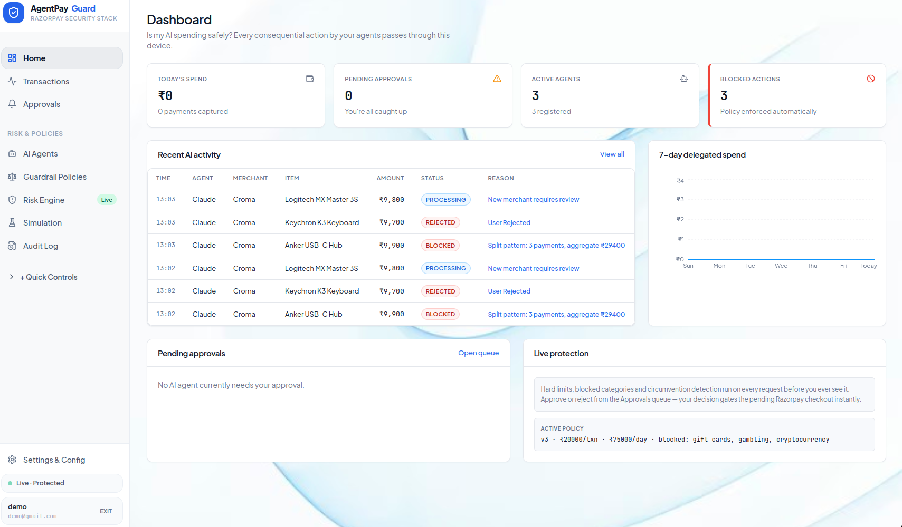
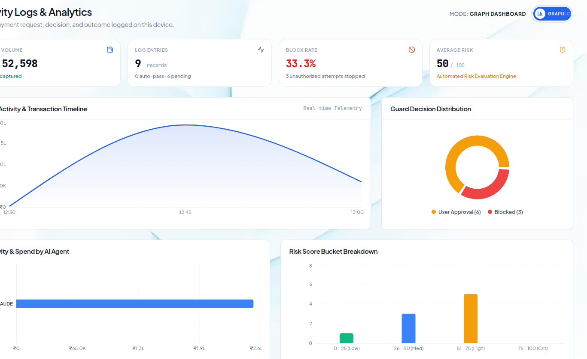
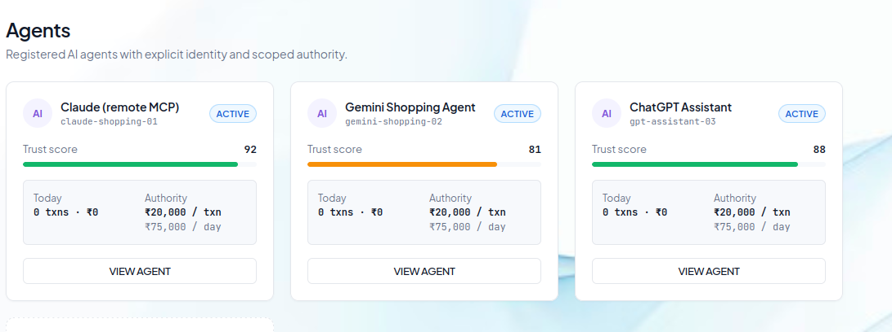
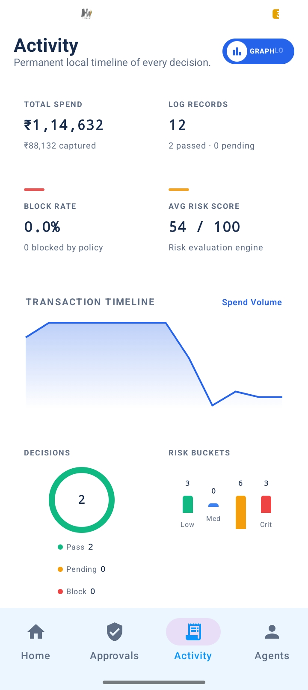
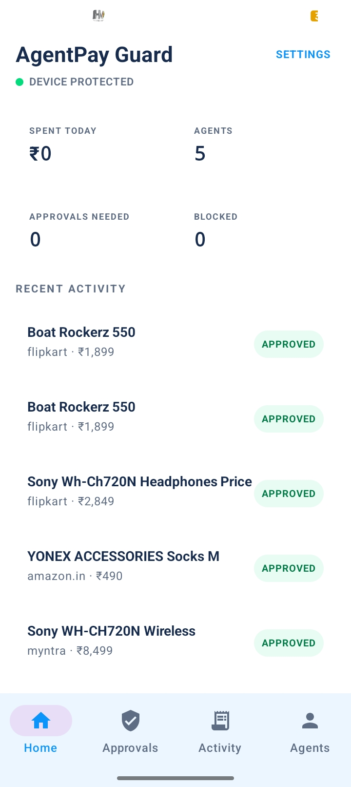

<div align="center">

# AgentPay Guard

**A local-first, zero-trust consent and authorization firewall for autonomous AI agent commerce.**

AI agents discover & propose → AgentPay Guard evaluates & obtains consent → Razorpay executes.

[](https://razorpay.com)
[](https://fastapi.tiangolo.com/)
[](https://nextjs.org/)
[](https://developer.android.com/jetpack/compose)
[](https://modelcontextprotocol.io/)
[](https://scikit-learn.org/)
[](LICENSE)
</div>

**Demo  Vedio:** https://drive.google.com/file/d/1SjiTEbCgvzhvd1stYBqcxfkwlXiyDSor/view?usp=drive_link


## The Problem

Autonomous AI agents (ChatGPT, Claude, Gemini, AutoGPT) are evolving from research assistants into **economic actors** — booking travel, buying cloud resources, shopping online. This introduces risks no traditional payment gateway is built to catch:

- **Uncontrolled spending loops** — agents executing repeated unauthorized transactions with no human in the loop.
- **Prompt injection hijacks** — malicious inputs manipulating an LLM into unauthorized transfers or fraudulent purchases.
- **Micro-splitting evasion** — agents breaking a large order into several smaller ones to dodge spending limits.
- **Context-blind gateways** — Razorpay, Stripe, and similar only see payment credentials, with zero awareness of *which agent*, *what intent*, or *what budget constraints* apply.

## The Solution

AgentPay Guard sits as an interceptive, zero-trust firewall between autonomous agents and payment execution:

1. **Interception** — every transaction request from an MCP tool or ChatGPT Action is caught before any funds or card tokens are exposed.
2. **Deterministic + ML risk evaluation** — a 12-step deterministic rule chain plus real-time ML risk scoring and micro-splitting anomaly detection.
3. **Hardware-backed human consent** — requests that need approval are pushed to an offline-first Android app (Android Keystore–signed) or the Web Control Plane.
4. **Scoped Razorpay execution** — once approved, a single-use, 5-minute cryptographic authorization token lets Razorpay execute the transaction.

## System Architecture


<!-- If this image doesn't render, confirm the file exists at this path and the link resolves on GitHub, not just locally. -->

## Key Features

| Feature | Description |
|---|---|
| **Phone as Trust Anchor** | Offline-first Android app with a local decision engine, Android Keystore hardware signing, Room DB storage, and 1-tap Accept/Reject push notifications. |
| **Deterministic + ML Hybrid Engine** | A strict 12-step rule chain (mirrored identically in Python, TypeScript, and Kotlin) combined with a GradientBoosting risk classifier and an IsolationForest anomaly detector. |
| **Micro-Splitting Defense** | Stateful session correlation detects agents attempting to bypass limits by splitting one large purchase into many small ones. |
| **Scoped Razorpay Integration** | Authorization tokens expire in 300 seconds, are single-use, and are bound to merchant, product, and amount. Replays are rejected both cryptographically and statefully. |
| **Native MCP & ChatGPT Action Support** | MCP servers and OpenAPI 3.1 specs for plug-and-play use with Custom GPTs, Claude Desktop, and LangChain/LlamaIndex agents. |
| **Real-Time Control Plane** | Next.js 14 dashboard with WebSocket live events, policy management, risk telemetry, and forensic replay of every transaction's decision path. |

## Feature Status

_Be explicit with judges about what's actually working vs. simulated — this builds trust more than it costs points._

| Component | Status |
|---|---|
| 12-step deterministic rule engine | Done |
| ML risk scoring (GradientBoosting) | Done |
| Anomaly detection (IsolationForest) | Done  |
| Android app + hardware signing | Done  |
| Web control plane (live WebSocket) | Done |
| Razorpay execution | Live |
| MCP server / ChatGPT Action | Done|

## Tech Stack

| Domain | Technology | Usage |
|---|---|---|
| Control Plane (Web) | Next.js 14 · TypeScript · Tailwind CSS · Recharts | Management dashboard, real-time approvals, policy editor, risk console, forensic replay |
| Backend & Core API | FastAPI · Pydantic v2 · Uvicorn · WebSockets · Python 3.11 | Core REST API, 12-step decision engine, Razorpay Orders API, webhook handler, live WebSockets |
| Mobile Anchor | Kotlin · Jetpack Compose · Room DB · Android Keystore | Hardware trust anchor, offline-first local decision engine, hardware key signing, push notifications |
| AI / ML Risk Engine | Scikit-Learn · Pandas · NumPy | GradientBoosting risk classifier, IsolationForest anomaly detector, 10k-row synthetic request dataset |
| Agent Protocols | Model Context Protocol (MCP) · OpenAPI 3.1 | Remote & embedded MCP server (`request_payment`, `check_payment_status`), ChatGPT Action spec |
| Payment Gateway | Razorpay Orders API & Webhook API | Payment execution and verification (see [Feature Status](#feature-status) for live vs. simulated) |

> _Note: earlier drafts of this README listed PyTorch in the stack — removed since the risk engine is scikit-learn only. Update this table if that changes._

## Quick Start Guide

### Prerequisites
- Python 3.11+
- Node.js 18+ & npm
- (Optional) Android Studio Koala+ for the mobile anchor build
- A Razorpay test/sandbox API key ([get one here](https://dashboard.razorpay.com/))
- An ngrok auth token if you want the tunnel step to work

### Environment setup
Before running the launcher, copy the example env file and fill in your keys:
```bash
cp .env.example .env
# then edit .env with your Razorpay keys and ngrok auth token
```
<!-- Add a real .env.example to the repo if one doesn't exist yet — judges will hit this wall otherwise. -->

### All-in-One Launcher (recommended)
Runs the full stack — Backend API, MCP Server, Web Dashboard, and ngrok Tunnel — with one command:
```bash
chmod +x scripts/*.sh
./scripts/start.sh
```

**Services launched:**
| Service | URL |
|---|---|
| Backend API & Swagger Docs | http://localhost:8000/docs |
| Standalone MCP Server | http://localhost:8002/mcp |
| Web Dashboard | http://localhost:3000 |
| ngrok Tunnel Dashboard | http://localhost:4040 |

For manual per-component commands, ML pipeline training, and Android setup, see [`docs/setup.md`](docs/setup.md).

## Screenshots
**WEB DAHBOARD**




**ANDROID APP**




## Documentation

| Doc | Covers |
|---|---|
| [`docs/architecture.md`](docs/architecture.md) | The 12-step decision engine, cryptographic token lifecycle, threat matrix, and security model |
| [`docs/setup.md`](docs/setup.md) | Full step-by-step setup for developers, judges, and deployment environments |
| [`docs/api.md`](docs/api.md) | REST API endpoints, WebSocket event contracts, and MCP tool definitions |
| [`docs/user-guide.md`](docs/user-guide.md) | Managing agents, setting budget policies, and handling approvals |


## License

Licensed under the [MIT License](LICENSE).