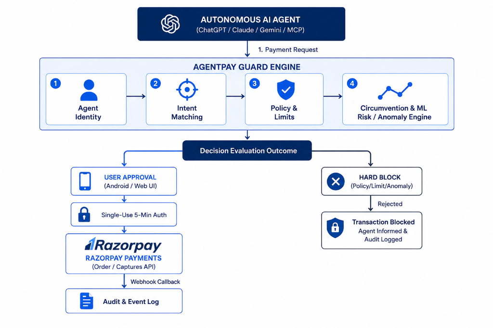

# System Architecture — AgentPay Guard

> **A zero-trust consent and authorization firewall for AI agent commerce.**

---

## Executive Summary

AgentPay Guard acts as a local security boundary and authorization firewall positioned between autonomous AI shopping agents (e.g. Claude, ChatGPT, Gemini) and payment execution gateways like **Razorpay**. 

When an AI agent attempts to make a purchase, AgentPay Guard intercepts the request, runs it through a **12-step hybrid decision engine** (deterministic rules + ML risk scoring + session circumvention defense), and requires user approval for high-risk or policy-triggered actions. Upon approval, it issues a **scoped, 5-minute single-use authorization token** for secure payment execution on Razorpay.

---

## System Overview & Architecture Diagram




---

## Component Stack & Descriptions

### 1. Backend API & Core Engine (`src/backend/`)
- **Technology**: FastAPI, Python 3.11+, Pydantic v2, Uvicorn, WebSockets.
- **Responsibilities**:
  - Serves as the central API gateway for agents, the web dashboard, and the mobile app.
  - Implements the **12-Step Deterministic & ML Hybrid Policy Engine** (`app/engine.py`).
  - Integrates with **Razorpay API** (`app/services/razorpay_service.py`) for creating payment orders, fetching payment status, and handling webhooks.
  - Maintains in-memory thread-safe state store (`app/state.py`) with persistence to `data/state.json`.
  - Broadcasts real-time events (`approvals_updated`, `transaction_created`, `agent_status_changed`) via WebSockets (`app/ws.py`).

### 2. Web Control Plane (`src/web/`)
- **Technology**: Next.js 14 (App Router), TypeScript, Vanilla CSS / Tailwind, Recharts.
- **Responsibilities**:
  - Displays real-time executive dashboard (Today's Spend, Pending Approvals, Active Agents, Blocked Actions, 7-day spend chart).
  - Interactive **Pending Approvals Queue** allowing instant Accept/Reject actions.
  - **Policy Management Editor**: Live configuration of transaction limits, daily limits, monthly limits, blocked merchant/category lists, and approval thresholds.
  - **Forensic Replay & Audit Log**: Line-by-line timeline view for every transaction request, policy decision, risk reason, and payment result.
  - **Simulation Console**: Interactive trigger for testing agent behaviors and attack vectors.

### 3. Android Trust Anchor (`src/android/`)
- **Technology**: Kotlin, Jetpack Compose, Room Database, Android Keystore.
- **Responsibilities**:
  - Acts as the primary mobile consent device ("Phone as the Trust Anchor").
  - Local Room database stores policy snapshots and transaction history offline.
  - Intercepts pending approval notifications and presents 1-tap **Accept / Reject** actions.
  - Hardware-backed signing key protection via Android Keystore to verify approval integrity.

### 4. Machine Learning & Anomaly Engine (`src/ml/`)
- **Technology**: Scikit-Learn, PyTorch, Pandas, NumPy, Joblib.
- **Responsibilities**:
  - **GradientBoosting Classifier**: Evaluates transaction risk score (`0.0 - 1.0`) based on agent history, amount, merchant category, velocity, and time-of-day.
  - **IsolationForest Anomaly Detector**: Flags high-velocity burst requests and unusual transaction sequences.
  - **Micro-Splitting Correlation Engine**: Detects circumvention attempts where an agent breaks a single large payment into smaller micro-transactions to stay below transaction limits.

### 5. MCP Server & ChatGPT Action (`src/mcp/` & `docs/openapi_chatgpt_action.json`)
- **Technology**: FastMCP (Model Context Protocol), OpenAPI 3.1.
- **Responsibilities**:
  - Exposes `request_payment`, `check_payment_status`, `get_guard_policy`, and `search_products` as native tools to Claude Desktop, Custom GPTs, and AI frameworks.
  - Renders dynamic Checkout web views for agents to complete authorized purchases.

### 6. Razorpay Payment Gateway Integration
- **Technology**: Razorpay Python SDK, Razorpay Checkout JS.
- **Responsibilities**:
  - Authorizations issued by Guard create a Razorpay Order (`order_xxxxxx`).
  - Client checkout uses Razorpay JS Modal; server-side verification confirms payment signature and captures funds securely.

---

## Complete Request & Payment Lifecycle

```
[Agent] ---> (1) Submit Payment Request (Product, Amount, Merchant)
                 |
                 v
        [12-Step Decision Engine]
                 |
      +----------+----------+
      |                     |
   [BLOCK]          [USER_APPROVAL] / [ALLOW]
      |                     |
      v                     v
 (Logged &        (Creates Pending Request)
 Returned)                  |
                            v
                 [Notification & Approvals Queue]
                            |
                     (User Accepts)
                            |
                            v
               [Issues Scoped Auth Token (5-min TTL)]
                            |
                            v
              [Razorpay Order Created & Checkout Link]
                            |
                            v
             [User Completes Payment on Razorpay]
                            |
                            v
             [Payment Verified & CAPTURED Logged]
```

1. **Request Submission**: An AI Agent invokes `request_payment` via REST or MCP.
2. **Policy Evaluation**: The 12-step engine checks Revocation, Category, Merchant, Transaction Limit, Daily Limit, Intent, Circumvention, New Merchant, and ML Risk.
3. **Decision & Routing**:
   - If **BLOCK**: The transaction is immediately rejected with an immutable reason code.
   - If **ALLOW**: An authorization is immediately created.
   - If **USER_APPROVAL**: The request enters the pending queue; WebSockets push an alert to the web control plane and mobile app.
4. **User Action**: The user reviews request details and clicks **Accept** (or **Reject**).
5. **Authorization Token**: Upon acceptance, a single-use `auth_xxxxxx` token (5-minute TTL) is generated.
6. **Execution**: The agent or checkout page calls `/guard/execute`, creating a Razorpay Order. Payment is completed and verified against Razorpay signatures.

---

## Threat Model & Security Boundaries

| Threat Vector | Mitigation Strategy in AgentPay Guard |
|---|---|
| **Rogue Agent Spending Loop** | Hard single transaction limits, daily cumulative spend caps, and agent freeze state. |
| **Prompt Injection Hijack** | Category/merchant blocklists and strict user approval requirements for high-risk items. |
| **Micro-Splitting Evasion** | Stateful correlation engine detects aggregate velocity across rapid windowed transactions (`CIRCUMVENTION_DETECTED`). |
| **Replay & Token Forgery** | Authorizations expire in 300 seconds, are single-use, and bound to exact merchant + amount parameters. |
| **Silent Retries** | Immutable audit logs track every single attempt and decision code; silent automated retry loops are forbidden. |
